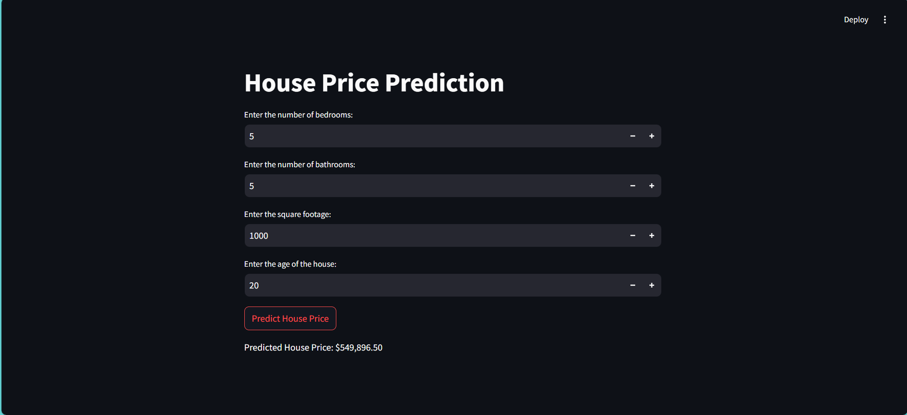

# House Price Prediction Project

## Overview
This project was completed as part of my summer internship in 2024. The goal was to develop a machine learning model capable of predicting house prices based on certain features such as the number of bedrooms, bathrooms, square footage, and the age of the house. The project uses Python, `scikit-learn` for building the machine learning model, and Streamlit for creating an interactive web application.

## Project Files
- `file.py`: This script is responsible for loading the dataset, training a linear regression model, and saving the model as a `.pkl` file.
- `app2.py`: This script creates a web application using Streamlit. The user can input house features, and the model predicts the house price based on those inputs.
- `house_price_model.pkl`: The trained machine learning model.
- `house_price_prediction_dataset.csv`: The dataset used to train the model.

## Dataset
The dataset (`house_price_prediction_dataset.csv`) contains the following columns:
- **num_bedrooms**: Number of bedrooms in the house.
- **num_bathrooms**: Number of bathrooms in the house.
- **square_footage**: Total square footage of the house.
- **age_of_house**: Age of the house in years.
- **house_price**: The actual house price (used as the target for prediction).

## Project Workflow

1. **Data Loading and Preprocessing**:  
   The dataset is loaded and the relevant features (bedrooms, bathrooms, square footage, and age) are selected for model training. The target variable is the house price.

2. **Model Training**:  
   A Linear Regression model is trained using `scikit-learn`. The dataset is split into training and testing sets (80% training and 20% testing). After training, the model is saved as `house_price_model.pkl` using `joblib`.

3. **Web Application**:  
   A simple web application is created using Streamlit. Users can input the number of bedrooms, bathrooms, square footage, and house age, and the app predicts the house price using the pre-trained model.

## House Price Prediction Output

Below is an example of the web application after predicting a house price based on user input:




## How to Run

### 1. Clone the Repository
```bash
git clone https://github.com/Parshuramsingh013/House-Price-Prediction
